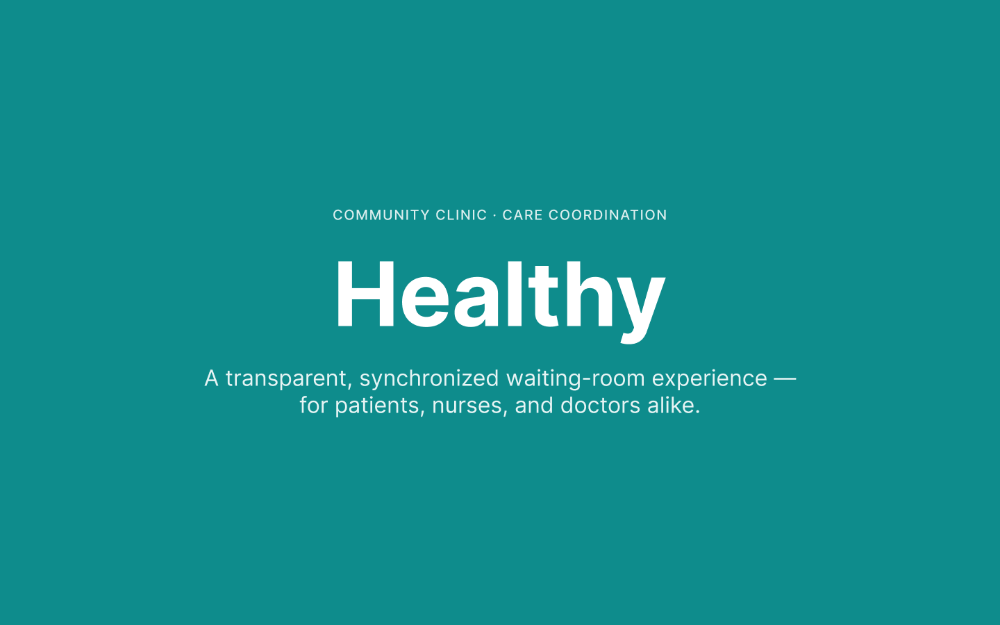
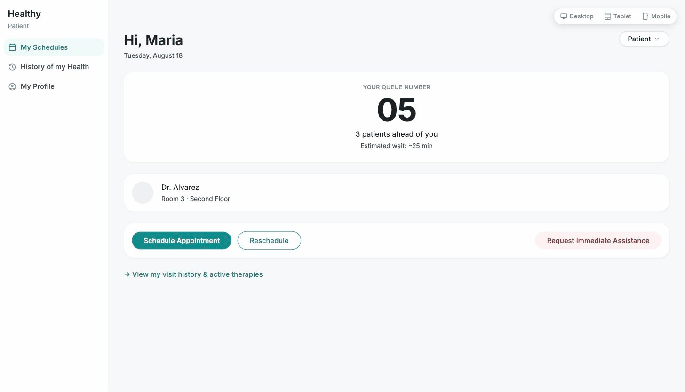
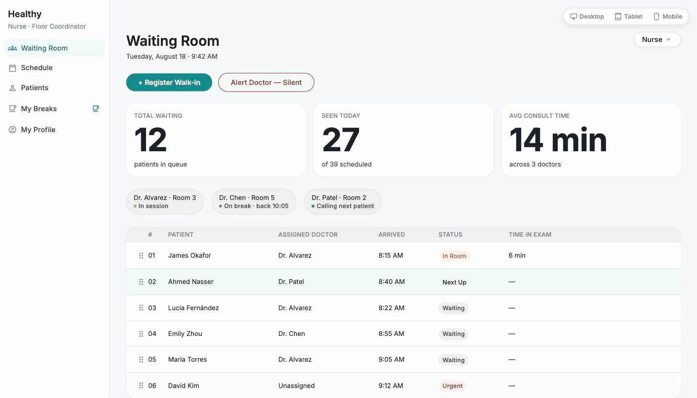
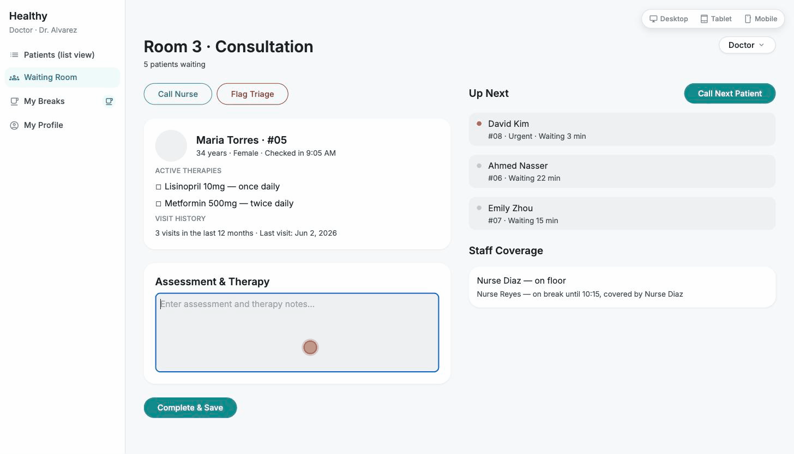

# Healthy

A real-time queue, capacity, and wait-time management prototype that gives patients, nurses, and doctors at a non-profit community clinic shared visibility into who's waiting, who's next, and who's available.

## Figma Designs

**[View the full Figma file →](https://www.figma.com/design/wDUfGU27ygEXwE9KA7Bv3t/Healthy?node-id=42-2)**

## Executive Summary

### The Problem

Healthy is a non-profit community clinic operating as a critical healthcare safety net in medically underserved regions, treating all patients regardless of insurance status, income, or background. The clinic has no real-time way to track queue, capacity, or wait times, which creates three compounding problems:

- **Patients** wait for long, unbounded periods with no visibility into whether they'll be seen that day — causing anxiety and a loss of time autonomy.
- **Nurses** absorb the friction of manually calming an anxious, tired queue with no system support for crowd management.
- **Doctors** are overwhelmed by consultation volume and stay anxious about waiting-room conditions even during breaks, since they lose visibility the moment they step away.

### The Roles We Tackled

| Role | Problem | Solution |
| --- | --- | --- |
| **Patient** | No visibility into queue position, wait time, or assigned doctor — high anxiety, no time autonomy | Live queue number, patients-ahead count, estimated wait time, doctor/room lookup, self-scheduling, one-tap emergency assistance request, and personal visit/therapy history |
| **Nurse** | Manages the entire floor queue and crowd manually, with no operational dashboard or silent way to reach doctors | Waiting-room analytics dashboard (total waiting, seen today, avg. consult time), full patient list with live status, drag-to-reorder queue, doctor status at a glance, and a silent alert channel to doctors |
| **Doctor** | No unified view of the active patient, upcoming queue, or staff coverage — breaks mean losing all visibility | Unified consultation workspace: active patient details and therapy checklist, clinical notes entry, "Call Next Patient" queue control, remaining-patient count, and nurse coverage status |

## Demo

Each role gets a short (~3s) walkthrough gif, paired with the solution it demonstrates.

### Patient



Checks live queue number, patients ahead, estimated wait time, and assigned doctor/room — then triggers an immediate assistance request in one tap.

### Nurse



Views the full waiting room at a glance — total waiting, doctor status, and patient queue — then drags an urgent walk-in to the top of the line.

### Doctor



Reviews the active patient's history and therapies, logs assessment notes, and calls the next patient from the Up Next queue.

## Tech Stack

- **React 19** + **TypeScript**
- **Vite** — dev server & build tooling
- **Tailwind CSS v3** — design tokens & styling
- **React Router v7** — routing
- **Oxlint** — linting

## Getting Started

```bash
cd app
npm install
npm run dev
```

The app opens with a role switcher (Patient / Nurse / Doctor) in the header, and a Desktop / Tablet / Mobile preview toggle for reviewing all three responsive breakpoints in one browser window.

## What's Mocked vs. Real

**Mocked (prototype scope):**
- All patient, doctor, nurse, and queue data — no real database
- Authentication — no login, no real user accounts; each role is a single fixed persona
- Full scheduling, medical-records, and billing workflows beyond what's shown in the three role views

**Real:**
- All UI, layout, and responsive behavior (desktop/tablet/mobile) is fully implemented, not static mockups
- Interactive elements that don't require cross-role sync — e.g. the clinical notes textarea, dismissible banners, the Up Next drawer — are functional
- Cross-role live sync (e.g. Doctor's "Call Next Patient" updating the Nurse's queue view in real time) is the one interaction still pending a shared mock data store — see open work in progress
